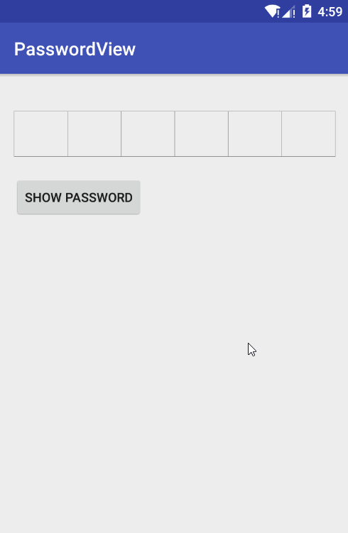

# PasswordView

An android view to input number password.



## Getting started

* Import the library module and add library dependency to your build.gradle

```
dependencies {
    ...
    compile project(':passwordview')
}
```

## Usage

* Add the PasswordView to your layout file

```xml
<com.kasogg.passwordview.PasswordView
    android:id="@+id/password_view"
    android:layout_width="match_parent"
    android:layout_height="50dp"
    android:layout_marginTop="25dp"
    app:pvBorderColor="@android:color/black"
    app:pvBorderRadius="2dp"
    app:pvBorderWidth="1dp"
    app:pvPasswordColor="@android:color/black"
    app:pvPasswordLength="6"
    app:pvPasswordPlaceholderRadius="6dp"/>
```

* In your code

```java
mPasswordView = (PasswordView) findViewById(R.id.password_view);
mPasswordView.setInputCallback(new PasswordView.InputListener() {
    @Override
    public void onFinish(String password) {
        //Do something when finish input
        Toast.makeText(MainActivity.this, password, Toast.LENGTH_SHORT).show();
    }
});

Button button = (Button) findViewById(R.id.btn_show_password);
button.setOnClickListener(new View.OnClickListener() {
    @Override
    public void onClick(View v) {
        Toast.makeText(MainActivity.this, mPasswordView.getText(), Toast.LENGTH_SHORT).show();
    }
});
```